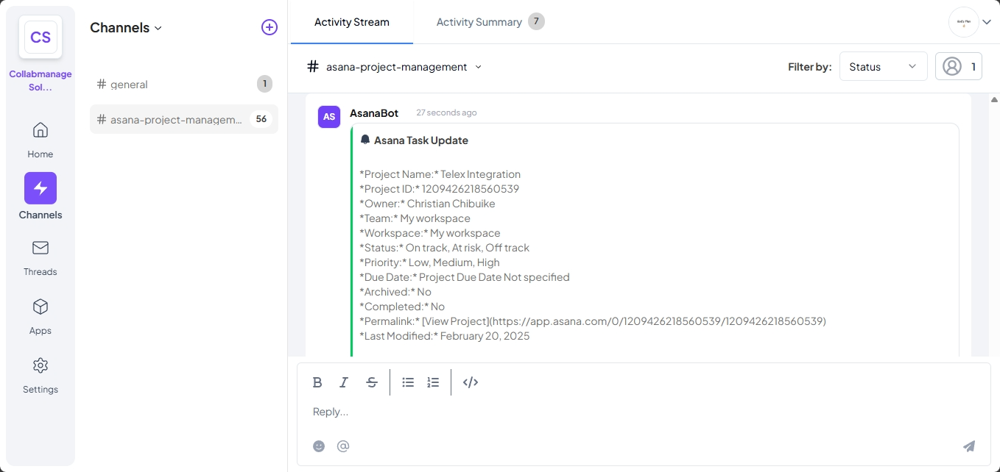

# Asana-Telex Integration

## Overview
This project integrates Asana with Telex, enabling automatic updates from Asana projects and tasks to be sent to a specified Telex channel. The integration functions as an **Interval Integration**, routing project and task data from Asana to Telex.

## Features
- Fetches project and task details from Asana.
- Formats the retrieved data into a structured message.
- Sends the formatted message to a Telex return URL.
- Handles errors gracefully, ensuring reliability.

## Integration Type
**Interval Integration**: Interval integrations are integrations that send messages to a channel at set intervals.

## Requirements
- Node.js (v14 or later recommended)
- An Asana API Key
- A valid Telex account

## Setup & Installation

### 1. Clone the Repository
```bash
  git clone https://github.com/telex_integrations/asana-telex-integration.git
  cd asana-telex-integration
```

### 2. Install Dependencies
```bash
  npm install
```

### 3. Configure Environment Variables
Create a `.env` file in the root directory with the following variables:
```ini
PORT=3000
ASANA_ACCESS_TOKEN=YOUR_ASANA_ACCESS_TOKEN
ASANA_PROJECT_ID=YOUR_ASANA_PROJECT_ID
WEBHOOK_URL=YOUR_TELEX_WEBHOOK_URL
INTEGRATION_URL=YOUR_INTEGRATION_DEPLOYED_URL
TICK_URL=YOUR_TICK_URL
CRON_FALLBACK_INTERVAL=*/9 * * * *
```

### 4. Start the Server
```bash
  nodemon app.js
```

## Usage
1. **Telex will provide the `return_url`** in the body of the request when it triggers the integration.
2. The server listens for a `POST` request at `/tick`. The `return_url` is dynamically extracted from the request body, and the response will be sent to this URL.
   
   When testing locally or simulating Telex requests, you can manually provide a `return_url` for testing purposes.

### Example of Testing with Postman:
- Send a `POST` request to `http://localhost:3000/tick` with the following JSON body:
  ```json
  {
    "return_url": "https://your-telex-webhook-url.com"
  }
  ```
  Replace `"https://your-telex-webhook-url.com"` with a real URL where you want to test the response (e.g., Webhook.site for mock testing).

### Example of `return_url` received in production:
In production, Telex will send a `return_url` similar to this:
```json
{
  "return_url": "https://ping.telex.im/v1/return/0195373c-9e03-74be-a5bf-744871fb3b6e"
}
```

3. The server will fetch Asana project data, format it, and send it to the `return_url`.

## API Endpoints

### **Process Tick**
- **Endpoint:** `/tick`
- **Method:** `POST`
- **Payload (Telex sends `return_url` dynamically):**
  ```json
  {
    "return_url": "https://your-telex-webhook-url.com"
  }
  ```
  - **Note:** In production, **Telex will provide the `return_url` dynamically**. This `return_url` is where the processed data will be sent.

- **Response:**
  ```json
  {
    "message": "Tick processed & response sent to Telex"
  }
  ```

## Deployment
To deploy the integration:
1. Push your code to a GitHub repository under the `telex_integrations` org.
2. Host the JSON configuration file publicly.
3. Deploy the integration to a designated Telex test organization.

## Testing
- Test locally using `Postman` or `curl`.
- Ensure the response is correctly formatted and sent to Telex.
- Implement unit tests for reliability.
  
  **Note:** When testing locally, you can manually provide a mock `return_url` (e.g., via Webhook.site).

## Screenshots
Below is a screenshot of the Asana-Telex integration in action:



## Contribution
- Follow Git best practices.
- Use meaningful commit messages.
- Ensure code is well-documented.

---
